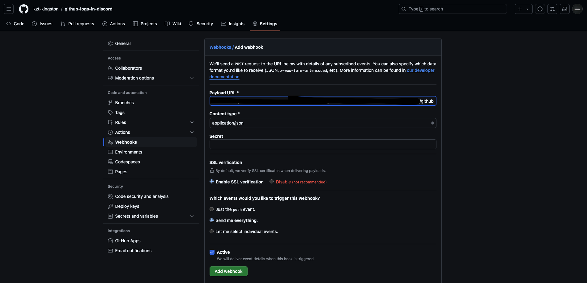

# GitHub Logs များကို Discord Channel မှာပြသခြင်း (Webhook အသုံးပြုခြင်း)

ဒီလမ်းညွှန်မှာ GitHub logs (push events, pull requests စသဖြင့်) ကို Discord channel ထဲသို့ webhook အသုံးပြု၍ အလိုအလျောက်ပို့ခြင်းကို လေ့လာပါမည်။

## လိုအပ်ချက်များ

- GitHub အကောင့်
- Discord အကောင့်
- Discord server မှာ Admin/Moderator ရှိရမည်
- Logs များကို ပြသလိုသော repository

---

## လုပ်ဆောင်ချက်များ

### 1. Discord မှာ Webhook တည်ဆောက်ခြင်း

1. Discord app ကို ဖွင့်ပါ။
2. Logs များကို ပြသလိုသော server သို့ သွားပါ။
3. Server အမည်ကို အပေါ်ဘက် ဘယ်ခြမ်းမှာနှိပ်ပြီး **Server Settings** > **Integrations** သို့သွားပါ။
4. **Webhooks** > **Create Webhook** ကိုနှိပ်ပါ။
5. Webhook အတွက် အမည် (ဥပမာ: "GitHub Logs") ထည့်ပါ၊ logs များပြသလိုသော channel ကို ရွေးပါ။
6. **Webhook URL** ကိုကူးယူပါ။ GitHub အတွက် ဒီ URL လိုအပ်ပါမည်။

### 2. GitHub Webhook ထည့်သွင်းခြင်း

1. GitHub repository ကို ဖွင့်ပါ။
2. **Settings** > **Webhooks** (ဘယ်ဘက် sidebar) သို့သွားပါ။
3. **Add Webhook** ကိုနှိပ်ပါ။
4. Discord မှ ကူးထားသော **Webhook URL** နဲ. သူ.ရဲ.နောက်ဆုံးမှာ **/github** ဆိုပီးထပ်ပေါင်းထည့်လိုက်ပါ ပီးသွားရင်တော့ **Payload URL** မှာ ထည့်သွင်းပါ။
5. **Content type** ကို `application/json` သို့ ပြောင်းပါ။
6. **Which events would you like to trigger this webhook?** အောက်မှာ ကိုယ်ကြိုက်နှစ်သက်သလို setting ကိုပြောင်းနိုင်ပါတယ်:
   - **Just the push event** ကို ရွေးပါ (push logs များသာလိုအပ်ပါက)။
   - **Let me select individual events** ကို ရွေးပါ (pull requests, issues စသည်ဖြင့် events များလည်းလိုအပ်ပါက)။
7. **Add Webhook** ကိုနှိပ်ပြီး save လုပ်ပါ။

### 3. Webhook ကို စမ်းသပ်ခြင်း

1. Commit လုပ်ခြင်း (သို့) pull request တစ်ခုဖွင့်ပါ။
2. Discord channel သို့ သွားပြီး logs များကို မက်ဆေ့ကြောင့်များအဖြစ် ရရှိပါမည်။

